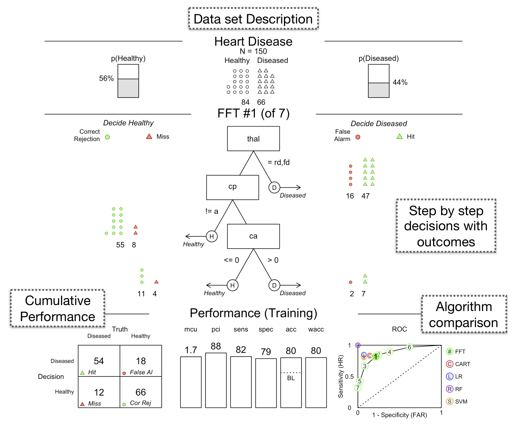
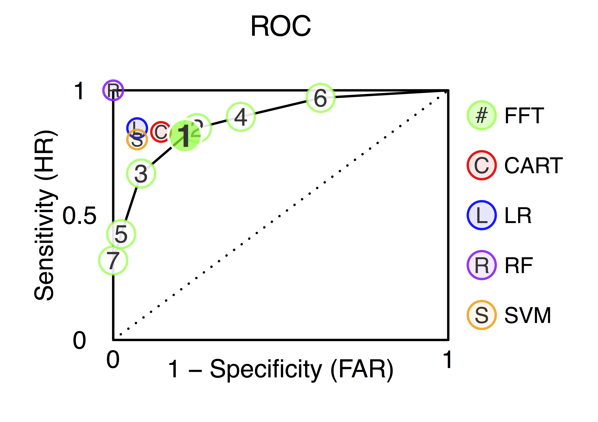
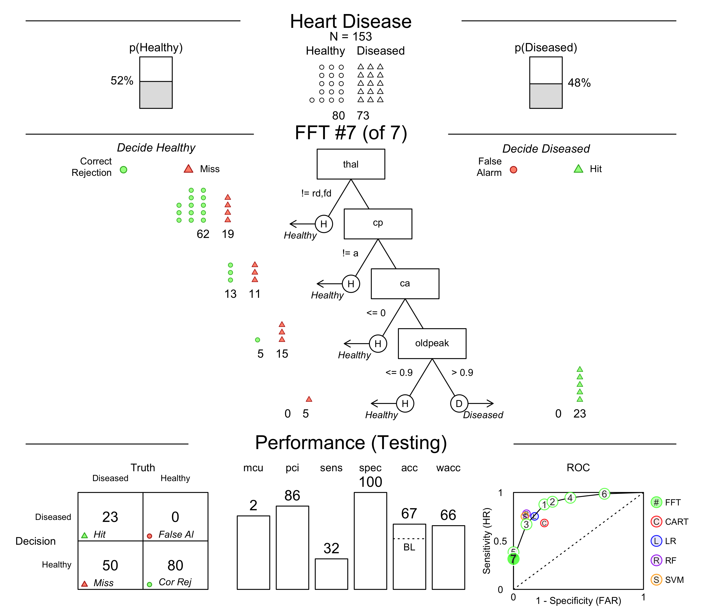
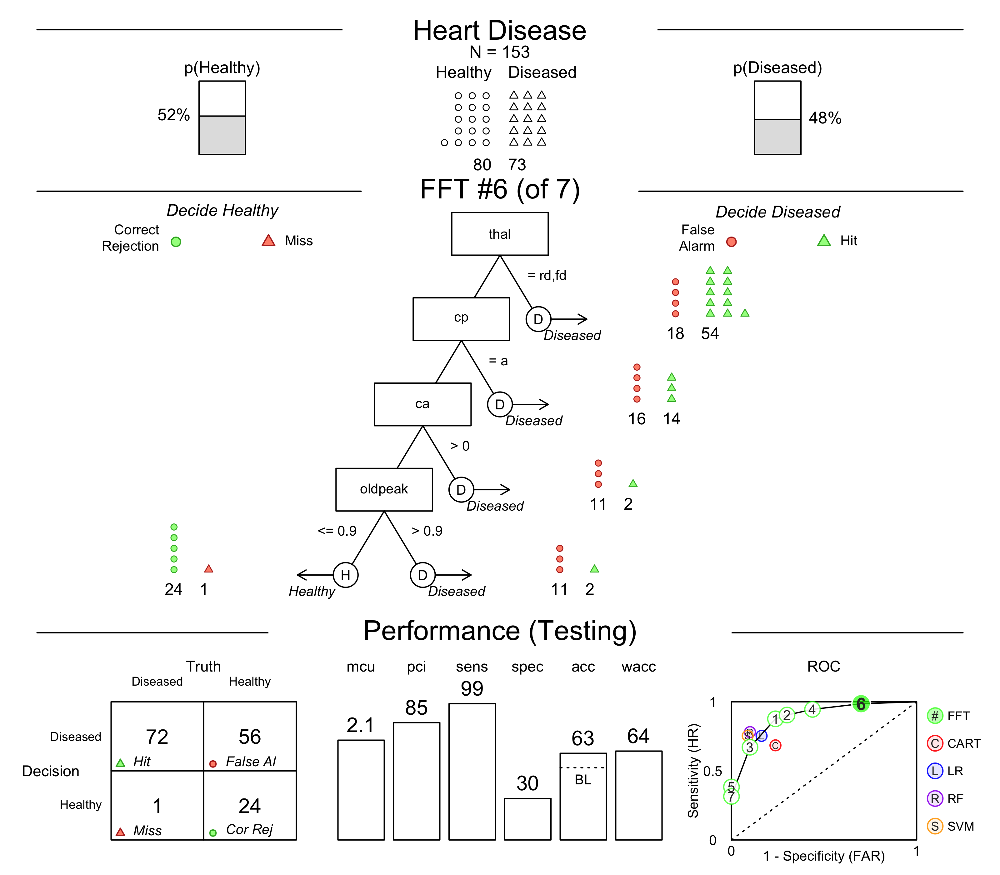
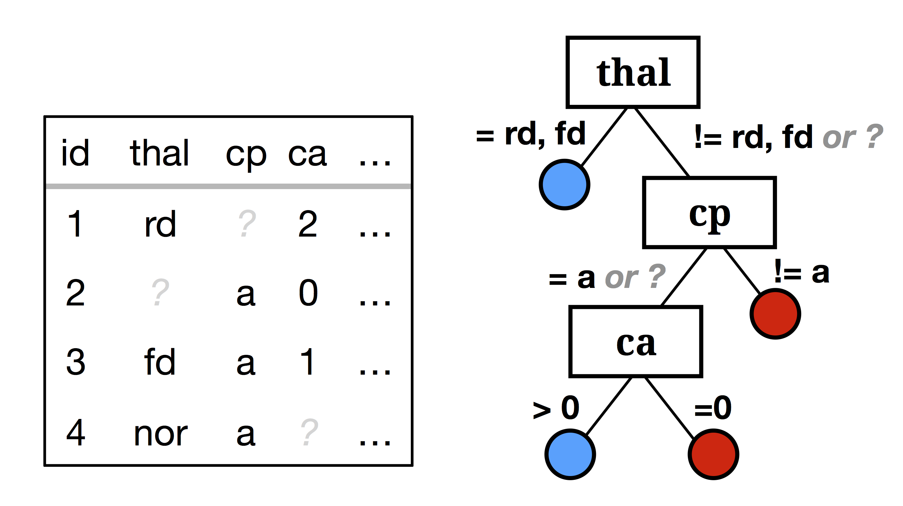
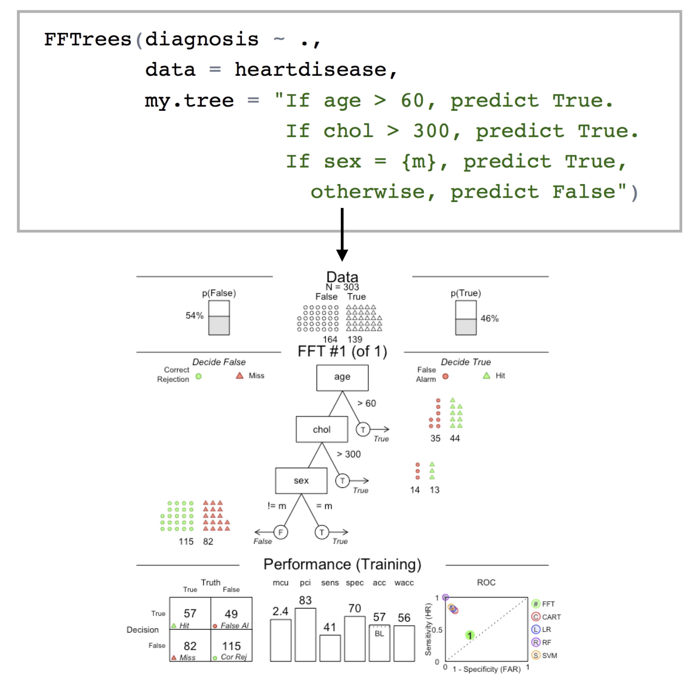
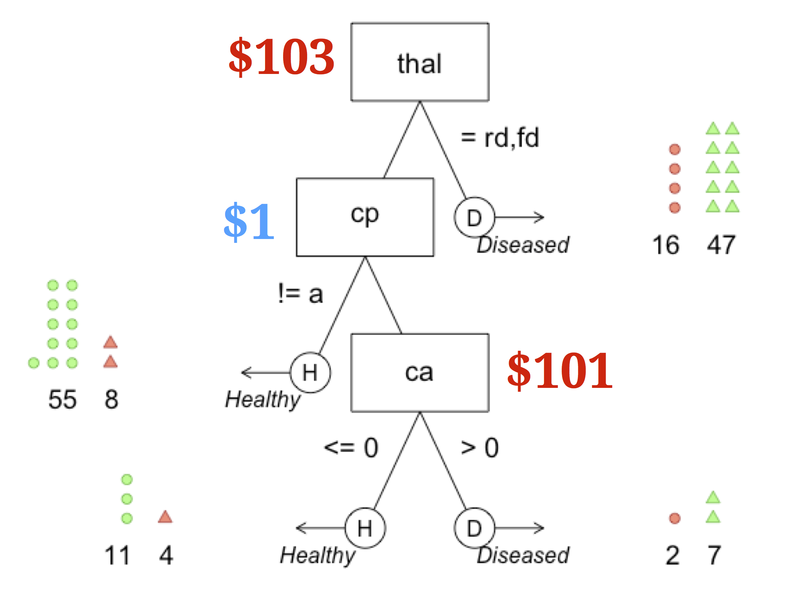
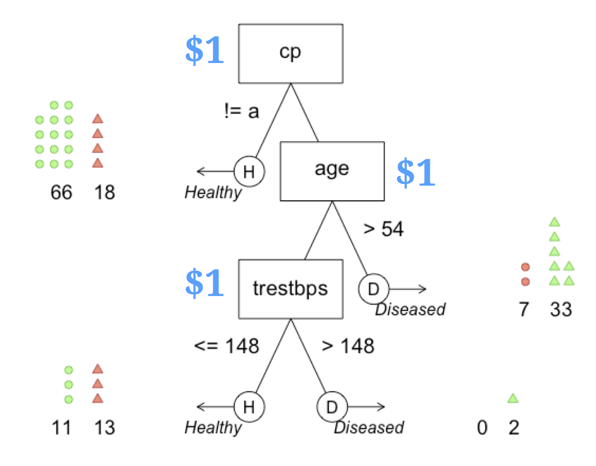

```{r setup, include=FALSE, fig.align = 'center'}
knitr::opts_chunk$set(echo = FALSE, fig.align = 'center')
library(FFTrees)


#  Step 2: Create the FFTrees object
heart_FFT <- FFTrees(formula = diagnosis ~., # Criterion
                     data = heart.train,     # Training data
                     data.test = heart.test, # Testing data
                     main = "Heart Disease", # Optional Labels
                     decision.labels = c("Healthy", "Diseased")) 


htmltools::tagList(rmarkdown::html_dependency_font_awesome())

```

class: title-slide-custom

.pull-left65[

<br><br><br>

## FFTrees: How to create extremely simple, transparent, predictive decision algorithms for both machine learning and clinical decision applications.

<br>

<font size = 6> Dr. Nathaniel D. Phillips<br><br3><a href="http://www.roche.com/">Roche, Personalised Health Care</a></font>
<br><br3>

<font size = 5><i class="fa fa-tv"></i>   Slides: <a href='https://ndphillips.github.io/RMedicine_2018/'>https://ndphillips.github.io/RMedicine_2018/s</a></font>

<br>

<font size = 5>R/Medicine, New Haven, 7 September, 2018</font>

<br>
]

.pull-right35[

<br><br><br><br>
```{r, out.width = "100%"}
knitr::include_graphics("images/heartfft.png")
```

]

---

<br><br><br><br><br>

# How can one make good decisions based on complex, noisy, limited information given limited resources?

---

```{r}
knitr::include_graphics(c("images/three_ex_1.png"))
```

---
count: false

```{r}
knitr::include_graphics(c("images/three_ex_2.png"))
```

---
count: false

```{r}
knitr::include_graphics(c("images/three_ex_3.png"))
```

---
count: false

```{r}
knitr::include_graphics(c("images/three_ex_4.png"))
```

---

```{r, out.width = "100%"}
knitr::include_graphics(c("images/cook_er_full.png"))
```


---

```{r, out.width = "100%"}
knitr::include_graphics(c("images/er_decision_1.png"))
```

---
count: false

```{r, out.width = "100%"}
knitr::include_graphics(c("images/er_decision_2.png"))
```

---
count: false

```{r, out.width = "100%"}
knitr::include_graphics(c("images/er_decision_3.png"))
```

---
count: false

```{r, out.width = "100%"}
knitr::include_graphics(c("images/er_decision_4.png"))
```

---
count: false

```{r, out.width = "100%"}
knitr::include_graphics(c("images/er_decision_5.png"))
```

---
count: false

```{r, out.width = "100%"}
knitr::include_graphics(c("images/er_decision_x.png"))
```

---
count: false

```{r, out.width = "100%"}
knitr::include_graphics(c("images/er_decision_6.png"))
```

---
count: false

```{r, out.width = "100%"}
knitr::include_graphics(c("images/er_decision_7.png"))
```


---

.pull-left5[

### Problem

<font size = 5>Inconsistent decisions. Too many false-alarms</font>

<br>

### Solution

<font size = 5>A <font color = "blue">Fast-and-Frugal decision tree (FFT)</font> developed by Green & Mehr (1997)<font>
<br>

### Result
<font size = 5>Far fewer false-alarms than doctors<font>
<br4>

<font size = 5>Unlike a complex regression tool, was understood and <font color = "blue">actually used</font> by physicians<font>

<br4>


> The best tool in the world is worthless if it isn't used.

]


.pull-right5[


```{r, out.width = "75%"}
knitr::include_graphics(c("images/greenmehr_fft.png"))
```

<font size = 3>Source: Green & Mehr. (1997). What alters physician's decisions to admit to the coronary care unit?</font>

]


---

.pull-left4[

<br><br><br>
## What is an FFT?
<br2>
<font size=5>A <font color = "blue">Fast-and-Frugal Tree</font> (FFT) is a highly restricted decision tree.</font>
<br4>
<font size=5>Each node in the tree must have exactly 2 branches, where 1 branch is an exit branch leading to a decision leaf.</font>
<br4>
<font size=5>The final node must have 2 exit branches.</font>
<br><br><br><br><br><br>
<font size = 3>*Martignon et al. (2003). Naive and yet enlightened: From natural frequencies to fast and frugal decision trees*</font>

]


.pull-right6[

<br>
```{r, out.width = "100%"}
knitr::include_graphics(c("images/fft_definition_examples.png"))
```

]


---

.pull-left4[
<br><br><br>
## Benefits of FFTs

<font size=5>Communication, understanding, acceptance, use</font><br4>
<font size=5>Compare to expert knowledge</font><br4>
<font size=5>Focuses on what's most important</font><br4>
<font size=5>Reduces cost</font><br4>
<font size=5>Doesn't overfit - no false sense of magical abilities</font><br4>
<font size=5>Communicates errors, transparently</font><br4>

]


.pull-right55[
<br><br>

```{r, out.width = "100%"}
knitr::include_graphics(c("images/FFTs_benefits.png"))
```

]


---

.pull-left5[

```{r, out.width = "100%"}
knitr::include_graphics(c("images/fft_examples_images.png"))
```


]

.pull-right5[

```{r, out.width = "75%"}
knitr::include_graphics(c("images/blank_fft_B.png"))
```

]


---

.pull-left5[

```{r, out.width = "100%"}
knitr::include_graphics(c("images/fft_examples_images_depression_focus.png"))
```


]

.pull-right5[

### Depression FFT

```{r, out.width = "75%"}
knitr::include_graphics(c("images/depression_fft.png"))
```

<font size = 3>Jenny et al. (2013). Simple rules for detecting depression.</font>


]


---

.pull-left5[

```{r, out.width = "100%"}
knitr::include_graphics(c("images/fft_examples_images_military_focus.png"))
```


]

.pull-right5[

### Miltary Checkpoint FFT
<br>
<br>
```{r, out.width = "75%"}
knitr::include_graphics(c("images/terrorism_fft.png"))
```

<font size = 3>Keller & Katsikopoulos. (2016). On the role of psychological heuristics in operational research.</font>


]


---


.pull-left5[
<br><br>

### FFTrees R Package
<br3>
<font size = 5>v1.3.5 on CRAN (also on GitHub)</font>
<br3>
<font size = 5>A <font color = "blue">simple tool</font> that allows anyone to create and <font color = "blue">customize</font> FFTs</font>
<br4>
<font size = 5>Visualize tree decisions using <font color = "blue">icon arrays</font></font>
<br4>
<font size = 5>Incorporate cue and outcome<font color = "blue">costs</font></font>
<br4>
<font size = 5><font color = "blue">Easily compare</font> FFTs to other algorithms.</font>

]

.pull-right5[

```{r, out.width = "75%"}
knitr::include_graphics("images/FFTrees_GitHub_ss.jpg")
```

<center><a href = 'https://github.com/ndphillips/FFTrees'>https://github.com/ndphillips/FFTrees</a>

]


---
## Ex) Heart Disease

<br3>

<font size = 5><b>Data</b> 150 Training cases, 153 test cases</font>

<br>

| age| sex|cp | trestbps| chol| fbs|restecg     | thalach| exang| oldpeak|slope | ca|thal   | diagnosis|
|---:|---:|:--|--------:|----:|---:|:-----------|-------:|-----:|-------:|:-----|--:|:------|---------:|
|  63|   1|ta |      145|  233|   1|hypertrophy |     150|     0|     2.3|down  |  0|fd     |         0|
|  67|   1|a  |      160|  286|   0|hypertrophy |     108|     1|     1.5|flat  |  3|normal |         1|
|  67|   1|a  |      120|  229|   0|hypertrophy |     129|     1|     2.6|flat  |  2|rd     |         1|
|  37|   1|np |      130|  250|   0|normal      |     187|     0|     3.5|down  |  0|normal |         0|
|  41|   0|aa |      130|  204|   0|hypertrophy |     172|     0|     1.4|up    |  0|normal |         0|
|  56|   1|aa |      120|  236|   0|normal      |     178|     0|     0.8|up    |  0|normal |         0|

<br>

<font size = 5><b>Goal</b> Predict binary criterion (diagnosis) from a set of 13 numeric and factor features</font>
<br4>


<font size = 3>Source: UCI Machine Learning Database</font>


---
## 4 Steps to using FFTrees in R

.pull-left15[
<br3><br3>
<br>
<br>
<font size = 5>0.Install</font>
<br><br>

<font size = 5>1. Load</font>
<br>

<font size = 5>2. Create</font>
<br>
<br><br>
<br><br><br4>
<font size = 5>3. Print</font>
<br><br>

<font size = 5>4. Plot</font>
<br>

]

.pull-right85[

<br>

```{r, eval = FALSE, echo = TRUE}
# Step 0: Install FFTrees from CRAN
install.packages("FFTrees")

# Step 1: Load FFTrees
library(FFTrees)

#  Step 2: Create the FFTrees object
heart_FFT <- FFTrees(formula = diagnosis ~., # Criterion
                     data = heart.train,     # Training data
                     data.test = heart.test, # Testing data
                     main = "Heart Disease", # Optional Labels
                     decision.labels = c("Healthy", "Diseased")) 

# Step 3: Print the object
heart_FFT

# Step 4: Plot the tree and accuracy statistics
plot(heart_FFT)
```

]

---
## plot(heart_FFT, stats = FALSE)

---
count: false


## plot(heart_FFT, stats = FALSE)

.pull-left5[

```{r, out.width = "70%"}
knitr::include_graphics("images/heart_fft_nostats_2.png")
```

]

.pull-right5[
<br><br><br>
###thal
<br2>

<font size=5>Imaging test that measures blood flow to the heart</font>

### cp
<br2>

<font size=5>Type of chest pain</font>

### ca
<br2>

<font size=5>Number of major vessels colored by fluoroscopy</font>


]
---

## plot(heart_FFT)

---
count: false

## plot(heart_FFT)

.pull-left7[

```{r, out.width = "80%"}

```

]

.pull-right3[

<br>

<font size = 5>Dataset description</font>

<br><br>

<font size = 5>Tree and decisions displayed as <b>icon arrays</b>*</font>

<br><br><br>

<font size = 5>Aggregate classification statistics</font>


<br>

<font size = 3>* Galesic, et al. (2009). Using icon arrays to communicate medical risks</font>

]


---
count: false

## plot(heart_FFT)

.pull-left7[

```{r, out.width = "100%"}

```

]

.pull-right3[

<br>

<font size = 5>Algorithm comparison in ROC space</font>

<br><br>

<font size = 5>Multiple FFTs with different error trade-offs.</font>

<br><br><br>

]

---

## plot(heart_FFT, data = "test")


.pull-left7[


```{r, out.width = "80%"}
knitr::include_graphics("images/heart_fft_test.png")
```

]

.pull-right3[

<br>

<font size = 5>Easily apply tree to <b>new, test data</b> with data = "test"</font>

<br><br>

<font size = 5>Look for changes in decisions, and diagnose <b>errors</b> occur</font>

<br><br><br>

<font size = 5>Compare prediction accuracy to other algorithms</font>

]


---

## plot(heart_FFT, data = "test", tree = 7)

.pull-left7[

```{r, out.width = "80%"}

```

]

.pull-right3[

<br><br>

<font size = 5>Explore trees with different <b>exit structures</b> and <b>error trade-offs</b></font>

<br><br>

<font size = 5>Tree #7 has a very low false-alarm rate but a huge number of misses</font>

<br><br>

]

---
## plot(heart_FFT, data = "test", tree = 6)

.pull-left7[

```{r, out.width = "80%"}

```

]

.pull-right3[

<br><br>

<font size = 5>Explore trees with different <b>exit structures</b> and <b>error trade-offs</b></font>

<br><br>

<font size = 5>Tree #6 has very few misses but a huge number of false-alarms></font>

<br><br>
]


---


<br><br>
> # Bonus Features


---


.pull-left3[
<br><br>
## Bonus Features
<br><br>


<font size = 5>1. Missing data? No problem.</font>

]


.pull-right6[
<br><br><br>
```{r, out.width = "100%"}

```


]


---

.pull-left3[
<br><br>
## Bonus Features

<br><br>


<font size = 5>1. Missing data? No problem.</font>

<br4>

<font size = 5>2. Implement your own custom tree verbally.</font>


]

.pull-right6[
<br>
```{r, out.width = "90%"}

```

]

---

.pull-left3[

<br><br>
## Bonus Features

<br><br>

<font size = 5>1. Missing data? No problem.</font>

<br4>

<font size = 5>2. Implement your own custom tree verbally.</font>

<br4>

<font size = 5>3. Minimize feature and error costs.</font>

]


.pull-right6[
<br><br>
### Heart Disease feature costs

<br>

|     |age  |sex  |cp   |trestbps |chol |fbs  |restecg    |ca     |thal   |
|:----|:----|:----|:----|:--------|:----|:----|:-----|:------|:------|
|cost |$1 |$1 |$1 |$1     |$7 |$5 |$16  |$101 |$103 |


<font size = 5> Create FFTs that <i>minimize</i> costs</font>
<br4>

```{r, eval = FALSE, echo = TRUE}
# Minimise costs
FFTrees(data = heart.train,
        cost.cues = heart.cost,        # Feature costs
        cost.outcomes = c(0, 1, 1, 0), # Outcome costs
        goal = "cost")
```


]


---

.pull-left3[

<br><br>
## Bonus Features

<br><br>

<font size = 5>1. Missing data? No problem.</font>

<br4>

<font size = 5>2. Implement your own custom tree verbally.</font>

<br4>

<font size = 5>3. Minimize feature and error costs.</font>

]


.pull-right6[

### Cost Ignorant FFT

```{r, out.width = "80%"}

```

| | Cost Ignorant|Cost Minimizing |Change |
|------:|:----:|:-----:|:----:|
|     Cost / Patient|    $138|   <font color = "gray">?</font>   |   <font color = "gray">?</font> |
|     Accuracy|    81%|   <font color = "gray">?</font>  | <font color = "gray">?</font>  |

]

---

.pull-left3[

<br><br>
## Bonus Features

<br><br>

<font size = 5>1. Missing data? No problem.</font>

<br4>

<font size = 5>2. Implement your own custom tree verbally.</font>

<br4>

<font size = 5>3. Minimize feature and error costs.</font>

]


.pull-right6[

### Cost Minimising FFT

```{r, out.width = "80%"}

```

| | Cost Ignorant|Cost Minimizing |Change |
|------:|:----:|:-----:|:----:|
|     Cost / Patient|    $138| $2     |<font color="blue">-99%</font>    |
|     Accuracy|    81%|77%     |<font color="red">-5%</font>    |

]


---
<br><br>
> #But how well can a simple FFT actually predict data?

---

.pull-left5[

## 10 datasets from UCI ML database

```{r, out.width = "100%"}
knitr::include_graphics("images/ten_datasets.png")
```

<br>

<font size = 5>Procedure: 100 50/50 Cross validation simulations</font>
<br3>
<font size = 5>Criterion: Balanced Accuracy</font>
<br3>

$\Large bacc = mean(sens, spec)$

]

.pull-right5[
<br><br>

| title| cases|features |base rate |
|------:|----:|:-----|:----|
|     arrhythmia|    68|280     |0.29    |
|     audiology|    226|70     |0.10    |
|     breast|    683|10     |0.35    |
|     cmc|    1,473|10    |0.35    |
|     credit|    666|16     |0.45    |
|     dermatology|   358|35     |0.31    |
|     heart|   303     |14    |0.46
|     occupancy|   17,895|6     |0.21    |
|     voting|   435     |17    |0.61 |
|     yeast|   1,484     |19    |0.16 |


]

---
.pull-left5[
<br><br>

## Make a Prediction!
<br><br>
<h3>Across 10 datasets, I am 90% confident FFTrees reached between <font color='gray'>HIGH</font> % and <font color='gray'>LOW</font> % of the accuracy of random forests</h2>

]

.pull-right45[

```{r, out.width = "80%"}
knitr::include_graphics("images/simulation_prediction_thermometer.png")
```


]

---
### Simulation Results

<br>
```{r, out.width = "100%"}
knitr::include_graphics("images/FFTrees_simulation_performance.png")
```

### > Simple models can be surprisingly difficult to outperform

---

.pull-left5[
<br>
### How you can use FFTrees

See how well a stupid simple fast-and-frugal tree can predict data

Use as a performance reference for complex algorithms

<i>Make decisions!</i>

Communicate the basics of machine learning (accuracy, sensitivity, specificity) to non--experts


]


.pull-right5[
<br><br>
```{r}
knitr::include_graphics("images/heart_fft_test.png")
```

]


---


class: title-slide-custom

.pull-left65[

<br><br><br>

## Create powerful, transparent decision aids with FFTrees

<br>

<font size = 6> Dr. Nathaniel D. Phillips<br><br3><a href="http://phcanalytics.roche.com/">PD PHC Data Science</a></font>
<br><br3>

<font size = 5><i class="fa fa-tv"></i>   Slides: <a href='https://go.roche.com/BDE_FFTrees'>https://go.roche.com/BDE_FFTrees</a></font>

<br>

<font size = 5>Roche, Basel Data Enthusiasts and Skeptics, 9 July, 2018</font>

<br>
]

.pull-right35[

<br><br><br><br>
```{r, out.width = "100%"}
knitr::include_graphics("images/heartfft.png")
```

]


---
# Backup Slides


---

.pull-left35[

<br><br>
## "Fan" Algorithm

<br>
<font size = 5>1. For each feature, calculate a threshold that maximizes <font color = 'red'>accuracy</font></font>

]

.pull-right55[
<br><br><br>
<font size = 5>What is the best split for feature X?</font>

```{r, out.width = "100%"}
knitr::include_graphics("images/threshold.png")
```


]


---


.pull-left35[
<br><br>
## "Fan" Algorithm
<br>
<font size = 5>1. For each feature, calculate a threshold that maximizes <font color = 'red'>accuracy</font></font>

<br4>

<font size = 5>2. Rank order features by <font color = 'red'>accuracy</font> and select top <font color = 'red'>M</font> features.</font>

]


.pull-right55[
<br><br><br>
<font size = 5>What are the top M features?</font>
<br>
```{r, out.width = "100%"}
knitr::include_graphics("images/selectcues.png")
```


]


---

.pull-left35[
<br><br>
## "Fan" Algorithm

<br>
<font size = 5>1. For each feature, calculate a threshold that maximizes <font color = 'red'>accuracy</font></font>

<br4>


<font size = 5>2. Rank order features by <font color = 'red'>accuracy</font> and select top <font color = 'red'>M</font> features.</font>

<br4>


<font size = 5>3. Create $(M - 1)^2$ trees with all possible exit structures.</font>


]


.pull-right55[
<br><br><br>
```{r, out.width = "100%"}
knitr::include_graphics("images/fft_exits_heart_A.png")
```


]


---
count: false


.pull-left35[

<br><br>
## "Fan" Algorithm

<br>
<font size = 5>1. For each feature, calculate a threshold that maximizes <font color = 'red'>accuracy</font></font>

<br4>


<font size = 5>2. Rank order features by <font color = 'red'>accuracy</font> and select top <font color = 'red'>M</font> features.</font>

<br4>


<font size = 5>3. Create $(M - 1)^2$ trees with all possible exit structures.</font>

]


.pull-right55[
<br><br><br>
```{r, out.width = "100%"}
knitr::include_graphics("images/fft_exits_heart_B.png")
```


]


---
count: false


.pull-left35[
<br><br>
## "Fan" Algorithm


<br>
<font size = 5>1. For each feature, calculate a threshold that maximizes <font color = 'red'>accuracy</font></font>

<br4>


<font size = 5>2. Rank order features by <font color = 'red'>accuracy</font> and select top <font color = 'red'>M</font> features.</font>
<br4>


<font size = 5>3. Create $(M - 1)^2$ trees with all possible exit structures.</font>
<br4>

<font size = 5>4. Select the tree that maximizes <font color = 'red'>accuracy</font></font>


]


.pull-right55[
<br><br><br>
```{r, out.width = "100%"}
knitr::include_graphics("images/fft_exits_roc_A.png")
```

]


---
count: false


.pull-left35[

<br><br>
## "Fan" Algorithm


<br>
<font size = 5>1. For each feature, calculate a threshold that maximizes <font color = 'red'>accuracy</font></font>

<br4>


<font size = 5>2. Rank order features by <font color = 'red'>accuracy</font> and select top <font color = 'red'>M</font> features.</font>
<br4>


<font size = 5>3. Create $(M - 1)^2$ trees with all possible exit structures.</font>
<br4>

<font size = 5>4. Select the tree that maximizes <font color = 'red'>accuracy</font></font>

]


.pull-right55[
<br><br><br>
```{r, out.width = "100%"}
knitr::include_graphics("images/fft_exits_roc_B.png")
```

]


---
count: false


.pull-left35[

<br><br>
## "Fan" Algorithm

<br>
<font size = 5>1. For each feature, calculate a threshold that maximizes <font color = 'red'>accuracy</font></font>

<br4>


<font size = 5>2. Rank order features by <font color = 'red'>accuracy</font> and select top <font color = 'red'>M</font> features.</font>
<br4>


<font size = 5>3. Create $(M - 1)^2$ trees with all possible exit structures.</font>
<br4>

<font size = 5>4. Select the tree that maximizes <font color = 'red'>accuracy</font></font>

]


.pull-right55[
<br><br><br>
```{r, out.width = "100%"}
knitr::include_graphics("images/fft_exits_roc_C.png")
```

]


---

.pull-left5[
<br><br>
## Next steps
<br>
### Programming

- Write in C++
- Automate cross-validation to optimize parameters
- Allow for > 2 classes
- Error monitoring and error diagnosis

### Applications

- When do FFTs work well and when not?
- Compare other published regression techniques to FFTs

]

.pull-right5[
<br><br>
```{r, out.width = "100%"}
knitr::include_graphics("images/heart_fft_test.png")
```


]


---
## Overfitting

.pull-left5[

<font size=5>Data = Underlying functional form (signal) + irreducible error (noise).</font>
<br>

$\LARGE Y = f(x) + \epsilon$

<br>
<font size=5>A good model will try to approximate the true signal</font>
<br>

$\LARGE E(Y - \widehat{Y})^2 = [f(X) - \widehat{f}(X)]^2 + Var(\epsilon)$

<br>
<font size=5>However, prediction error is a combination of bias *and* variance</font>
<br>

$\large E(PredError) = Var(\hat{f}(x_{0})) + [Bias(\hat{f}(x_{0}))]^2 + Var(\epsilon)$

<br>
*James et al. (2013). An Introduction to Statistical Learning*

]


.pull-right5[

<br>
<br>
Given heavy irreducible noise, a simple model may outperform a complex one.
<br>

```{r, out.width = "90%"}
knitr::include_graphics("images/overfitting_darts.png")
```

]


---
## Icon Arrays


```{r, out.width = "80%"}
knitr::include_graphics("images/contraceptive_iconarray.png")
```


---
.pull-left3[

## Why Icon Arrays?

Help people quickly and easily compare relative frequencies

Much clearer than probabilities

Emphasizes absolute differences in risk rather than relative risk

<b>Contraceptive Pill Scare</b>

Relative Risk: You're 100% more likely to develop thrombosis (a life threatening blood clot) if you take the latest contraceptive pill

Absolute Risk: Previous: 1 / 7000  versus Latest: 2 / 7000


]


.pull-right7[


```{r, out.width = "100%"}
knitr::include_graphics(c("images/iconarray_psa_harding.jpg"))
```

]


---
.pull-left4[
<br><br>
## When will FFTs fail?

It is not difficult to imagine datasets where FFTs will fail<br>

FFTs will do poorly when...

- Strong interactions
- Noisy individual predictors with strong additive performance

FFTs will do well when...

- No strong interactions
- A few individual predictors have strong performance

]


.pull-right55[

### Prediction Simulation 

Two simulated datasets (4 features each) one with a strong interaction, one without

```{r, out.width = "100%", fig.align = 'center'}
knitr::include_graphics("images/interaction_simulation.png")
```

Conclusion: CART is consistently better than FFTrees when there are strong interactions

]

