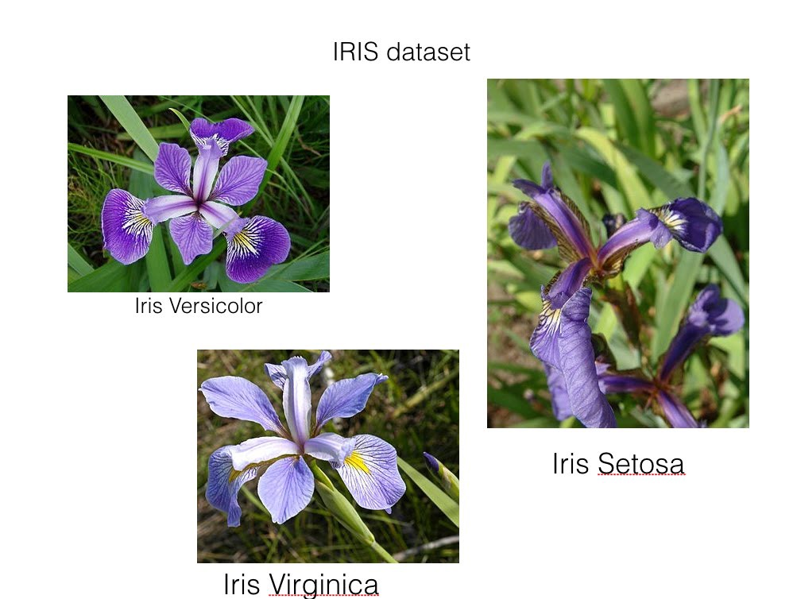

layout: true

<div class="my-footer"><span>
<font color="#7E7E7E">R/Medicine, New Haven, 7 September, 2018</font>
&emsp;&emsp;&emsp;&emsp;&emsp;&emsp;&emsp;&emsp;&emsp;&emsp;&emsp;
&emsp;&emsp;&emsp;&emsp;&emsp;
&emsp;&emsp;&emsp;&emsp;&emsp;&emsp;&emsp;&emsp;
&emsp;

<a href='https://ndphillips.github.io/RMedicine_2018/'><font color="#7E7E7E">https://ndphillips.github.io/RMedicine_2018</font></a>
&emsp;&emsp;&emsp;&emsp;&emsp;&emsp;&emsp;&emsp;&emsp;&emsp;&emsp;&emsp;&emsp;&emsp;&emsp;&emsp;&emsp;
&emsp;&emsp;&emsp;&emsp;&emsp;&emsp;&emsp;&emsp;

&emsp;&emsp;&emsp;&emsp;&emsp;

<a href="https://ndphillips.github.io/"><font color="#7E7E7E"> nathaniel.phillips@roche.com</font></a>


</span></div> 


```{r setup, include=FALSE, fig.align = 'center'}
knitr::opts_chunk$set(echo = FALSE, fig.align = 'center', dpi = 300)
library(FFTrees)


#  Step 2: Create the FFTrees object
heart_FFT <- FFTrees(formula = diagnosis ~., # Criterion
                     data = heart.train,     # Training data
                     data.test = heart.test, # Testing data
                     main = "Heart Disease", # Optional Labels
                     decision.labels = c("Healthy", "Diseased")) 


htmltools::tagList(rmarkdown::html_dependency_font_awesome())

```


---
class: title-slide-custom

.pull-left65[

<br>

# FFTrees
### How to create extremely simple, transparent, predictive decision algorithms for both machine learning and clinical decision applications.

<br>

<font size = 6> Dr. Nathaniel D. Phillips, Roche<br><br3></font>

<font size = 5><i class="fa fa-envelope"></i>  nathaniel.phillips@roche.com<br><br3></font>

<font size = 5><i class="fa fa-tv"></i>   Slides: <a href='https://ndphillips.github.io/RMedicine_2018/'>https://ndphillips.github.io/RMedicine_2018</a></font>

<br>

<br>
]

.pull-right35[

<br><br><br><br>
```{r, out.width = "100%"}

```

]

---

<br><br><br><br><br>

# How can a person with limited resources make good decisions based on limited, noisy, fallible information?

---

```{r}
knitr::include_graphics(c("images/three_ex_1.png"))
```

---
count: false

```{r}
knitr::include_graphics(c("images/three_ex_2.png"))
```

---
count: false

```{r}
knitr::include_graphics(c("images/three_ex_3.png"))
```

---
count: false

```{r}
knitr::include_graphics(c("images/three_ex_4.png"))
```

---
## Cook County Hospital, Chicago, 1990s

```{r, out.width = "80%"}
knitr::include_graphics(c("images/cook_er_full.png"))
```


---

```{r, out.width = "100%"}
knitr::include_graphics(c("images/er_decision_1.png"))
```

---
count: false

```{r, out.width = "100%"}
knitr::include_graphics(c("images/er_decision_2.png"))
```

---
count: false

```{r, out.width = "100%"}
knitr::include_graphics(c("images/er_decision_3.png"))
```

---
count: false

```{r, out.width = "100%"}
knitr::include_graphics(c("images/er_decision_4.png"))
```

---
count: false

```{r, out.width = "100%"}
knitr::include_graphics(c("images/er_decision_5.png"))
```

---
count: false

```{r, out.width = "100%"}
knitr::include_graphics(c("images/er_decision_x.png"))
```

---
count: false

```{r, out.width = "100%"}
knitr::include_graphics(c("images/er_decision_6.png"))
```

---
count: false

```{r, out.width = "100%"}
knitr::include_graphics(c("images/er_decision_7.png"))
```


---

.pull-left5[
<br><br>

### Problem

<font size = 5>Defensive medicine. Inconsistent decisions. Too many false-alarms</font>

### Solution

<font size = 5>A <font color = "blue">Fast-and-Frugal decision tree (FFT)</font> developed by Green & Mehr (1997)<font>
<br>

### Result
<font size = 5>Far fewer false-alarms than physicians<font>
<br4>

<font size = 5>Unlike a complex regression tool, was understood and <font color = "blue">actually used</font> by physicians<font>

<br4>

]

.pull-right5[

```{r, out.width = "75%"}
knitr::include_graphics(c("images/greenmehr_fft.png"))
```

Green & Mehr. (1997). What alters physician's decisions to admit to the coronary care unit?

]


---

.pull-left4[

<br><br><br>
## What is an FFT?
<br2>
<font size=5>A <font color = "blue">Fast-and-Frugal Tree</font> (FFT) is a <font color = 'blue'>highly restricted decision tree</font>.</font>
<br4>
<font size=5>Each node must have exactly 2 branches, where at least 1 branch leads to an (immediate) decision leaf.</font>
<br4>
<br><br><br><br><br><br>
<font size = 3>*Martignon et al. (2003). Naive and yet enlightened: From natural frequencies to fast and frugal decision trees*</font>

]


.pull-right6[

<br>
```{r, out.width = "100%"}
knitr::include_graphics(c("images/fft_definition_examples.png"))
```

]


---

.pull-left5[

```{r, out.width = "100%"}
knitr::include_graphics(c("images/fft_examples_images.png"))
```


]

.pull-right5[

```{r, out.width = "75%"}
knitr::include_graphics(c("images/blank_fft_B.png"))
```

]


---

.pull-left5[

```{r, out.width = "100%"}
knitr::include_graphics(c("images/fft_examples_images_depression_focus.png"))
```


]

.pull-right5[

### Depression FFT

```{r, out.width = "75%"}
knitr::include_graphics(c("images/depression_fft.png"))
```

<font size = 3>Jenny et al. (2013). Simple rules for detecting depression.</font>


]


---

.pull-left5[

```{r, out.width = "100%"}
knitr::include_graphics(c("images/fft_examples_images_military_focus.png"))
```


]

.pull-right5[

### Miltary Checkpoint FFT
<br>
<br>
```{r, out.width = "75%"}
knitr::include_graphics(c("images/terrorism_fft.png"))
```

<font size = 3>Keller & Katsikopoulos. (2016). On the role of psychological heuristics in operational research.</font>


]


---


.pull-left4[
## Benefits of FFTs

<font size=5>Dead simple to communicate</font><br4>
<font size=5>Can be implemented 'in the head'</font><br4>
<font size=5>Compare to (and incorporate) expert knowledge</font><br4>
<font size=5>Focus on a few critical pieces of information</font><br4>
<font size=5>Low risk of overfitting - no false sense of magical abilities</font><br4>
<font size=5>Communicate errors. Transparently.</font><br4>

]

.pull-right55[
<br>

```{r, out.width = "100%"}
knitr::include_graphics(c("images/fft_benefits.png"))
```

]

---


.pull-left55[
<br><br>

## FFTrees R Package

<font size = 5>A simple, flexible tool for creating, customizing, visualizing, and implementing fast-and-frugal trees</font>

<font size = 5>v1.3.5 on CRAN (v1.4.0 on GitHub)</font>
<br>

```{r, eval = FALSE, echo = TRUE}
# Install FFTrees from CRAN
install.packages("FFTrees")
# devtools::install_github("ndphillips/FFTrees")

# Load FFTrees
library(FFTrees)
```

```{r, include = FALSE}
# Step 1: Load FFTrees
library(FFTrees)
```


]

.pull-right45[
<br>
```{r, out.width = "75%"}
knitr::include_graphics("images/FFTrees_GitHub_ss.jpg")
```

<center><a href = 'https://github.com/ndphillips/FFTrees'>https://github.com/ndphillips/FFTrees</a>

]


---
## Heart Disease


<font size = 5>Goal: Create a model to predict diagnosis (binary)</font>

<br>

| age| sex|cp | trestbps| chol| fbs|restecg     | thalach| exang| oldpeak|slope | ca|thal   | diagnosis|
|---:|---:|:--|--------:|----:|---:|:-----------|-------:|-----:|-------:|:-----|--:|:------|---------:|
|  63|   1|ta |      145|  233|   1|hypertrophy |     150|     0|     2.3|down  |  0|fd     |         0|
|  67|   1|a  |      160|  286|   0|hypertrophy |     108|     1|     1.5|flat  |  3|normal |         1|
|  67|   1|a  |      120|  229|   0|hypertrophy |     129|     1|     2.6|flat  |  2|rd     |         1|
|  37|   1|np |      130|  250|   0|normal      |     187|     0|     3.5|down  |  0|normal |         0|
|  41|   0|aa |      130|  204|   0|hypertrophy |     172|     0|     1.4|up    |  0|normal |         0|
|  56|   1|aa |      120|  236|   0|normal      |     178|     0|     0.8|up    |  0|normal |         0|

<br3>

### Two data sets

<font size = 5>heart.train: (N = 150)</font><br>

<font size = 5>heart.test (N = 153)</font>

<br>


<font size = 3>Source: UCI Machine Learning Database</font>


---
## Create an FFTrees object with FFTrees()


Create an `FFTrees` object with `FFTrees()`

```{r, echo = TRUE, eval = TRUE, message = FALSE}
#  Create an FFTrees object

heart_FFT <- FFTrees(formula = diagnosis ~.,         # Criterion
                     data = heart.train,             # Training data
                     data.test = heart.test,         # Testing data
                     main = "Heart Disease",         # Optional Labels
                     decision.labels = c("Healthy", "Diseased")) 

# FFTrees class
class(heart_FFT)

# Contains many outputs
names(heart_FFT)
```

heart_FFT
---
.pull-left55[

<h2>print.FFTrees()</h2>

```{r, echo = TRUE}
heart_FFT
```

]

.pull-right4[

<h2>plot.FFTrees()</h2>

```{r, eval = FALSE, echo = TRUE}
plot(heart_FFT, stats = FALSE)
```

<br><br>
```{r, out.width = "70%", eval = TRUE}
knitr::include_graphics("images/heart_fft_nostats_2.png")
```
]

---
.pull-left7[

```{r, echo = TRUE, out.width = "80%", fig.width = 7, fig.height = 6}
plot(heart_FFT)
# knitr::include_graphics("images/heart_fft_test.png")
```

]

.pull-right3[

<br>

<font size = 5>Dataset description</font>

<br><br>

<font size = 5>Tree and decisions displayed as icon arrays*</font>

<br><br><br><br><br>

<font size = 5>Aggregate classification statistics</font>


<font size = 3>* Galesic, et al. (2009). Using icon arrays to communicate medical risks</font>

]


---

.pull-left7[


```{r, echo = TRUE, out.width = "80%", fig.width = 7, fig.height = 6}
plot(heart_FFT, data = "test")
# knitr::include_graphics("images/heart_fft_test.png")
```

]

.pull-right3[

<br>

<font size = 5>Apply tree to new, test data with data = "test"</font>

<br><br>

<font size = 5>Look for changes in decisions, and diagnose errors</font>

<br><br><br><br>

<font size = 5>Compare prediction accuracy to other algorithms</font>

]


---

<br><br><br><br>


# We have lots of questions...
<br>
## ~ Decision Makers
<br><br><br>

ok, shoot.

---

.pull-left6[

<br><br><br>
### Why did the tree make those decisions?
<br>
### How it compares to other similar trees?

]

.pull-right4[
<br><br><br><br>
```{r, out.width = "200%", fig.width = 7, fig.height = 6}
plot(heart_FFT, "test")
# knitr::include_graphics("images/heart_fft_test.png")
```

]

---

.pull-left55[


```{r, echo = TRUE, fig.width = 7, fig.height = 7, out.width = "80%"}
plot(heart_FFT, data = "test")
```


]

.pull-right4[

<font size = 5>FFTrees objects contain many FFTs spanning ROC space.</font>
<br><br>

<font size = 5>Use the tree = X argument to explore different trees</font>
<br>

```{r, echo = FALSE, out.width = "100%"}

```


]


---

.pull-left55[


```{r, fig.width = 7, echo = TRUE, fig.height = 7, out.width = "80%"}
plot(heart_FFT, data = "test", tree = 7)
```


]

.pull-right4[

<font size = 5>FFTrees objects contain many FFTs spanning ROC space.</font>
<br><br>

<font size = 5>Use the tree = X argument to explore different trees</font>
<br>

```{r, echo = FALSE, out.width = "100%"}

```


]

---

.pull-left55[


```{r, echo = TRUE, fig.width = 7, fig.height = 7, out.width = "80%"}
plot(heart_FFT, data = "test", tree = 6)
```


]

.pull-right4[

<font size = 5>FFTrees objects contain many FFTs spanning ROC space.</font>
<br><br>

<font size = 5>Use the tree = X argument to explore different trees</font>
<br>

```{r, echo = FALSE, out.width = "100%"}

```


]


---

.pull-left6[

<br><br><br>
### Those tests are very time consuming and expensive.
<br>

### It's also much worse to miss a case than to have a false-alarm

<br>
### Can you account for these costs?

]

.pull-right4[
<br><br><br><br>
```{r, out.width = "200%", fig.width = 7, fig.height = 6}
plot(heart_FFT, "test")
# knitr::include_graphics("images/heart_fft_test.png")
```

]

---

.pull-left55[
<br><br>
## Cue costs

<font size = 5>Create a list of costs</font>
<br>

```{r, include = FALSE, eval = TRUE}
heart_cost_FFT <- FFTrees(diagnosis ~.,
                          cost.cues = heart.cost,
                          data = heart.train,
                          data.test = heart.test,
                          main = "Heart Disease")

```

<br>

```{r, eval = FALSE, echo = TRUE}
# List of cue costs

heart.cost <- list(thal = 102.9, 
                   sex = 1, 
                   ca = 100.9, ...)
```

<font size = 5>Include list of costs as cost.cues</font>


```{r, echo = TRUE, eval = FALSE}
FFTrees(diagnosis ~.,
        cost.cues = heart.cost,  # cue costs
        data = heart.train,
        data.test = heart.test,
        main = "Heart Disease")
```

<font size = 5>The tree now excludes the most expensive tests</font>


]

.pull-right45[
<br><br><br>
```{r, echo = FALSE, fig.width = 7, fig.height = 7}
plot(heart_cost_FFT, data = "test")
```

]

---

.pull-left55[
<br>
## Include outcome costs

<font size = 5>Specify the costs of decision outcomes with cost.outcomes</font>

- hi (Hits) = $0
- mi (Misses) = $75
- fa (False Alarms) = $25
- cr (Correct Rejections) = $0

```{r, include = FALSE, eval = TRUE}
heart_cost_FFT <- FFTrees(diagnosis ~.,
                          cost.cues = heart.cost,
                          cost.outcomes = list(mi = 75, fa = 25), # <-
                          data = heart.train,
                          data.test = heart.test,
                          main = "Heart Disease")
```


```{r, echo = TRUE, eval = FALSE}
FFTrees(diagnosis ~.,
        cost.cues = heart.cost,
        cost.outcomes = list(mi = 75, fa = 25), # <-
        data = heart.train,
        data.test = heart.test,
        main = "Heart Disease")
```

<font size = 5>The tree now tries to minimize both outcome <i>and</i> cue cost</font>

]

.pull-right45[
<br><br><br>
```{r, echo = FALSE, fig.width = 7, fig.height = 7}
plot(heart_cost_FFT, data = "test")
```

]


---

.pull-left6[

<br><br>
### I have a >2 class prediction problem

```{r, out.width = "70%"}

```

### Can FFTrees handle this?

]

.pull-right4[

]


---

.pull-left6[


<br><br>
### I have a 3 class prediction problem

```{r, out.width = "70%"}

```

### Can FFTrees handle this?

]

.pull-right4[
<br>
# No.

### Use rpart

```{r, eval = FALSE, echo = TRUE}
install.packages("rpart")
```


```{r, out.width = "100%"}

```


]


---

.pull-left6[

<br><br><br>
### I have an idea for a tree
<br><br>

### How would this one perform on our data?

]

.pull-right4[
<br><br><br>
```{r, out.width = "100%"}

```

]


---

.pull-left55[

## Create "my tree"

```{r, include = FALSE, eval = TRUE}
heart_cost_FFT <- FFTrees(diagnosis ~.,
                          cost.cues = list(thal = 102.9, ca = 100.9),
                          cost.outcomes = list(mi = 75, fa = 25),
                          data = heart.train,
                          data.test = heart.test,
                          main = "My Custom FFT",
                          my.tree = "If age > 55, predict True.
                                     If cp != {a}, predict False.
                                     If chol > 300, predict False.")

```

<br>
<font size = 5>Specify a custom FFT in words using the my.tree argument</font>


```{r, echo = TRUE, eval = FALSE}
# Specify an FFT in words
ihaka_fft <- "If age > 55, predict True.
              If cp != {a}, predict False.
              If chol > 300, predict False."

# Include as my.tree
FFTrees(formula, data,
        my.tree = ihaka_fft,    # Specify my.tree
        main = "My Custom FFT")

```


<font size = 5>As long as you specify a few simple rules, the result will be a 'legit' FFTrees object you can then use for prediction.</font>

]

.pull-right45[

<br><br><br>
```{r, echo = FALSE, fig.width = 7, fig.height = 7}
plot(heart_cost_FFT, data = "test")
```

]


---

.pull-left6[


<br><br><br><br>
### FFTs are nice for non--expert data scientists. But they can't be that predictive.

<br><br>
### But how well can an FFT compete with more complex algorithms?

]

.pull-right4[
<br><br><br><br><br>
```{r, out.width = "100%"}

```
FFTrees vs. Random Forests / GBM / SVM (?)


]


---

.pull-left5[

## Prediction Simulation

```{r, out.width = "100%"}

```

<br>


<font size = 5>10 data sets from the UCI ML repository</font><br3>

<font size = 5>FFTrees v CART v Regression v. Random Forests v. Support Vector Machines (...)</font>
<br3>

<font size = 5>100 50/50 Cross validation simulations</font>
<br3>
<font size = 5>Criterion: Prediction Balanced Accuracy: mean(Sensitivity, Specificity)</font>
<br3>

]

.pull-right45[
<br><br>

<font size = 5>10 data sets in prediction simulation</font>
<br>

| title| cases|features |base rate |
|------:|----:|:-----|:----|
|     arrhythmia|    68|280     |0.29    |
|     audiology|    226|70     |0.10    |
|     breast|    683|10     |0.35    |
|     cmc|    1,473|10    |0.35    |
|     credit|    666|16     |0.45    |
|     dermatology|   358|35     |0.31    |
|     heart|   303     |14    |0.46
|     occupancy|   17,895|6     |0.21    |
|     voting|   435     |17    |0.61 |
|     yeast|   1,484     |19    |0.16 |

Source: [UCI Machine Learning Repository](https://archive.ics.uci.edu/ml/datasets.html)

]

---
## Prediction Simulation

<br>

```{r, out.width = "100%"}

```

[Phillips et al. (2017).](http://journal.sjdm.org/17/17217/jdm17217.pdf) FFTrees: A toolbox to create [...]. Judgment and Decision Making. 12(4).

---
## Prediction Simulation

<br>

```{r, out.width = "100%"}

```

[Phillips et al. (2017).](http://journal.sjdm.org/17/17217/jdm17217.pdf) FFTrees: A toolbox to create [...]. Judgment and Decision Making. 12(4).


---
## Prediction Simulation

<br>

```{r, out.width = "100%"}

```

[Phillips et al. (2017).](http://journal.sjdm.org/17/17217/jdm17217.pdf) FFTrees: A toolbox to create [...]. Judgment and Decision Making. 12(4).


---

## Slow vs. Fast Worlds


```{r, out.width = "90%"}

```

When simple models have high accuracy, and complexity carries costs (Financial, comprehension, error diagnosis), simple models may be optimal.

---
class: title-slide-custom

.pull-left65[

<br>

# FFTrees
### How to create extremely simple, transparent, predictive decision algorithms for both machine learning and clinical decision applications.

<br>

<font size = 6> Dr. Nathaniel D. Phillips, Roche<br><br3></font>

<font size = 5><i class="fa fa-envelope"></i>  nathaniel.phillips@roche.com<br><br3></font>

<font size = 5><i class="fa fa-tv"></i>   Slides: <a href='https://ndphillips.github.io/RMedicine_2018/'>https://ndphillips.github.io/RMedicine_2018</a></font>

<br>

<br>
]

.pull-right35[

<br><br><br><br>
```{r, out.width = "100%"}

```

]

---
# Backup Slides


---

.pull-left55[
<br><br>
## What is FFTrees?

<br2>

<font size = 5>A flexible, interactive tool to create simple, effective, lost-cost decision aids</font><br><br2>


<font size = 5>Try it out, see what insights it provides.</font>

<br>

## What is it not?
<br3>
<font size = 5>A free lunch.</font><br><br2>

<font size = 5>FFTrees will sometimes 'fail'. Spectacularly. But transparently</font>

]

.pull-right45[
<br><br>
```{r}
knitr::include_graphics("images/heart_fft_test.png")
```

]

---
.pull-left65[
<br><br>
><font size = 5> No matter how brilliant the tool, if it does not satisfy decision makers' <font color = 'blue'>practical needs</font>, they won't use it.</font>
> <br><br>
>
><font size = 5>It is up to the designer to make the product understandable and useable by providing a good <font color = 'blue'>conceptual model that guides the user when things go wrong</font>.</font>
> <br><br>
><font size = 5>With a good conceptual model, people can diagnose and correct errors.</font>
> <br><br>
><font size = 5>Without a good model, when they encounter errors, they struggle, waste resources, get frustrated, and ultimately give up -- rendering your 'brilliant tool' worthless in the eye of the decision maker.</font>
> <br><br>
><font size = 5>Adapted (heavily) from "The Design of Everyday Things"</font>


]

.pull-right35[
<br><br><br><br><br>

```{r}

```
<br>
<font size = 5>Don Norman</font>

]


---

.pull-left35[

<br><br>
## "Fan" Algorithm

<br>
<font size = 5>1. For each feature, calculate a threshold that maximizes <font color = 'red'>accuracy</font></font>

]

.pull-right55[
<br><br><br>
<font size = 5>What is the best split for feature X?</font>

```{r, out.width = "100%"}
knitr::include_graphics("images/threshold.png")
```


]


---


.pull-left35[
<br><br>
## "Fan" Algorithm
<br>
<font size = 5>1. For each feature, calculate a threshold that maximizes <font color = 'red'>accuracy</font></font>

<br4>

<font size = 5>2. Rank order features by <font color = 'red'>accuracy</font> and select top <font color = 'red'>M</font> features.</font>

]


.pull-right55[
<br><br><br>
<font size = 5>What are the top M features?</font>
<br>
```{r, out.width = "100%"}
knitr::include_graphics("images/selectcues.png")
```


]


---

.pull-left35[
<br><br>
## "Fan" Algorithm

<br>
<font size = 5>1. For each feature, calculate a threshold that maximizes <font color = 'red'>accuracy</font></font>

<br4>


<font size = 5>2. Rank order features by <font color = 'red'>accuracy</font> and select top <font color = 'red'>M</font> features.</font>

<br4>


<font size = 5>3. Create $(M - 1)^2$ trees with all possible exit structures.</font>


]


.pull-right55[
<br><br><br>
```{r, out.width = "100%"}

```


]


---
count: false


.pull-left35[

<br><br>
## "Fan" Algorithm

<br>
<font size = 5>1. For each feature, calculate a threshold that maximizes <font color = 'red'>accuracy</font></font>

<br4>


<font size = 5>2. Rank order features by <font color = 'red'>accuracy</font> and select top <font color = 'red'>M</font> features.</font>

<br4>


<font size = 5>3. Create $(M - 1)^2$ trees with all possible exit structures.</font>

]


.pull-right55[
<br><br><br>
```{r, out.width = "100%"}
knitr::include_graphics("images/fft_exits_heart_B.png")
```


]


---
count: false


.pull-left35[
<br><br>
## "Fan" Algorithm


<br>
<font size = 5>1. For each feature, calculate a threshold that maximizes <font color = 'red'>accuracy</font></font>

<br4>


<font size = 5>2. Rank order features by <font color = 'red'>accuracy</font> and select top <font color = 'red'>M</font> features.</font>
<br4>


<font size = 5>3. Create $(M - 1)^2$ trees with all possible exit structures.</font>
<br4>

<font size = 5>4. Select the tree that maximizes <font color = 'red'>accuracy</font></font>


]


.pull-right55[
<br><br><br>
```{r, out.width = "100%"}
knitr::include_graphics("images/fft_exits_roc_A.png")
```

]


---
count: false


.pull-left35[

<br><br>
## "Fan" Algorithm


<br>
<font size = 5>1. For each feature, calculate a threshold that maximizes <font color = 'red'>accuracy</font></font>

<br4>


<font size = 5>2. Rank order features by <font color = 'red'>accuracy</font> and select top <font color = 'red'>M</font> features.</font>
<br4>


<font size = 5>3. Create $(M - 1)^2$ trees with all possible exit structures.</font>
<br4>

<font size = 5>4. Select the tree that maximizes <font color = 'red'>accuracy</font></font>

]


.pull-right55[
<br><br><br>
```{r, out.width = "100%"}
knitr::include_graphics("images/fft_exits_roc_B.png")
```

]


---
count: false


.pull-left35[

<br><br>
## "Fan" Algorithm

<br>
<font size = 5>1. For each feature, calculate a threshold that maximizes <font color = 'red'>accuracy</font></font>

<br4>


<font size = 5>2. Rank order features by <font color = 'red'>accuracy</font> and select top <font color = 'red'>M</font> features.</font>
<br4>


<font size = 5>3. Create $(M - 1)^2$ trees with all possible exit structures.</font>
<br4>

<font size = 5>4. Select the tree that maximizes <font color = 'red'>accuracy</font></font>

]


.pull-right55[
<br><br><br>
```{r, out.width = "100%"}
knitr::include_graphics("images/fft_exits_roc_C.png")
```

]


---

.pull-left5[
<br><br>
## Next steps
<br>
### Programming

- Write in C++
- Automate cross-validation to optimize parameters
- Allow for > 2 classes
- Error monitoring and error diagnosis

### Applications

- When do FFTs work well and when not?
- Compare other published regression techniques to FFTs

]

.pull-right5[
<br><br>
```{r, out.width = "100%"}
knitr::include_graphics("images/heart_fft_test.png")
```


]


---
## Overfitting

.pull-left5[

<font size=5>Data = Underlying functional form (signal) + irreducible error (noise).</font>
<br>

$\LARGE Y = f(x) + \epsilon$

<br>
<font size=5>A good model will try to approximate the true signal</font>
<br>

$\LARGE E(Y - \widehat{Y})^2 = [f(X) - \widehat{f}(X)]^2 + Var(\epsilon)$

<br>
<font size=5>However, prediction error is a combination of bias *and* variance</font>
<br>

$\large E(PredError) = Var(\hat{f}(x_{0})) + [Bias(\hat{f}(x_{0}))]^2 + Var(\epsilon)$

<br>
*James et al. (2013). An Introduction to Statistical Learning*

]


.pull-right5[

<br>
<br>
Given heavy irreducible noise, a simple model may outperform a complex one.
<br>

```{r, out.width = "90%"}
knitr::include_graphics("images/overfitting_darts.png")
```

]


---
## Icon Arrays


```{r, out.width = "80%"}
knitr::include_graphics("images/contraceptive_iconarray.png")
```


---
.pull-left3[

## Why Icon Arrays?

Help people quickly and easily compare relative frequencies

Much clearer than probabilities

Emphasizes absolute differences in risk rather than relative risk

<b>Contraceptive Pill Scare</b>

Relative Risk: You're 100% more likely to develop thrombosis (a life threatening blood clot) if you take the latest contraceptive pill

Absolute Risk: Previous: 1 / 7000  versus Latest: 2 / 7000


]


.pull-right7[


```{r, out.width = "100%"}
knitr::include_graphics(c("images/iconarray_psa_harding.jpg"))
```

]


---
.pull-left4[
<br><br>
## When will FFTs fail?

It is not difficult to imagine data sets where FFTs will fail<br>

FFTs will do poorly when...

- Strong interactions
- Noisy individual predictors with strong additive performance

FFTs will do well when...

- No strong interactions
- A few individual predictors have strong performance

]


.pull-right55[

### Prediction Simulation 

Two simulated data sets (4 features each) one with a strong interaction, one without

```{r, out.width = "100%", fig.align = 'center'}
knitr::include_graphics("images/interaction_simulation.png")
```

Conclusion: CART is consistently better than FFTrees when there are strong interactions

]


---
.pull-left5[
<br><br>

## Make a Prediction!
<br><br>
<h3>Across 10 data sets, I am 90% confident FFTrees reached between <font color='gray'>HIGH</font> % and <font color='gray'>LOW</font> % of the accuracy of random forests</h2>

]

.pull-right45[

```{r, out.width = "80%"}

```


]


